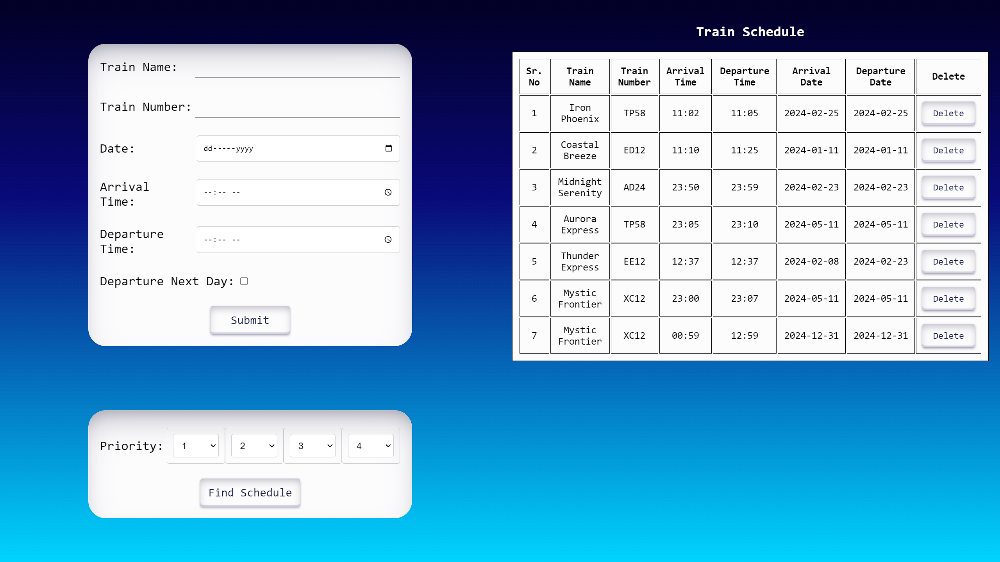
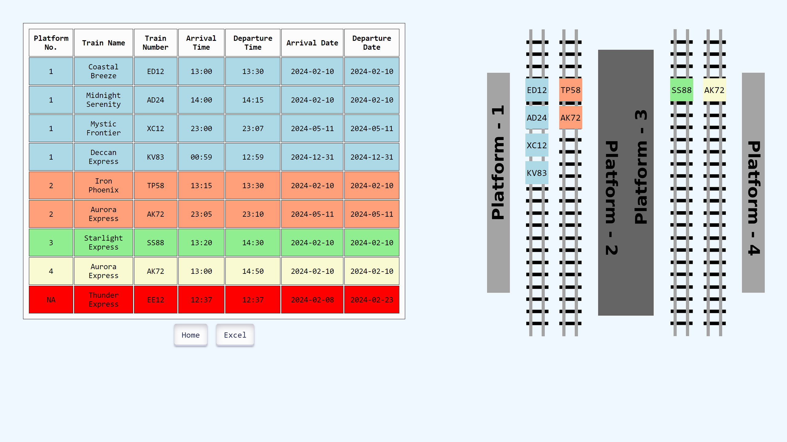
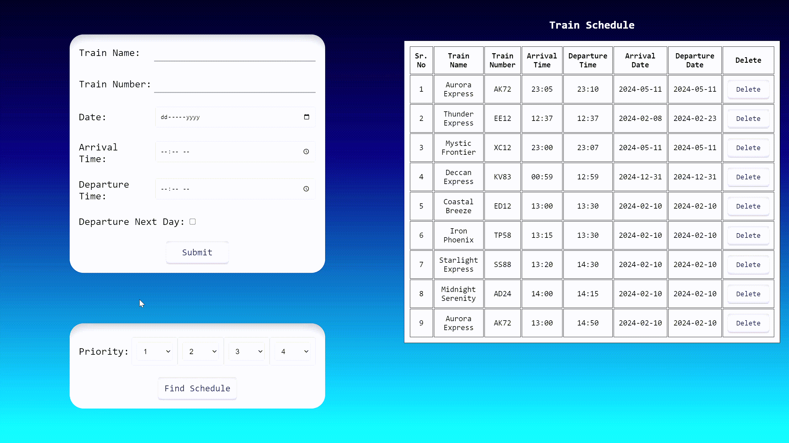

# Django Train Scheduler

This Django-based web application allows users to schedule and manage train activities. The application implements a multilayer activity selection algorithm to organize train schedules efficiently. Users can input details such as train name, train number, arrival date, departure date, arrival time, and departure time. The application provides features to visualize and organize train schedules based on priority.

## Features

- **Add Train Schedule:** Users can input train details, including arrival and departure information.
- **Delete Train Schedule:** Users can delete a train schedule entry.
- **Find Train Schedule:** Users can find and organize train schedules based on priority using a multilayer selection algorithm.

## Usage

1. Install the required packages using `pip install -r requirements.txt`.
2. Run the Django development server with `python manage.py runserver`.
3. Access the application in a web browser at [http://localhost:8000/](http://localhost:8000/).

## Screenshots

## Multilayer Activity Selection

The project leverages a multilayer activity selection algorithm for efficient organization of train schedules. This algorithm optimally selects and arranges train activities based on their priority, ensuring a streamlined schedule.

## Dependencies

- Django
- pymongo
- pandas
- openpyxl

## Contributors

- Shrey Patel
- Tirth Patel